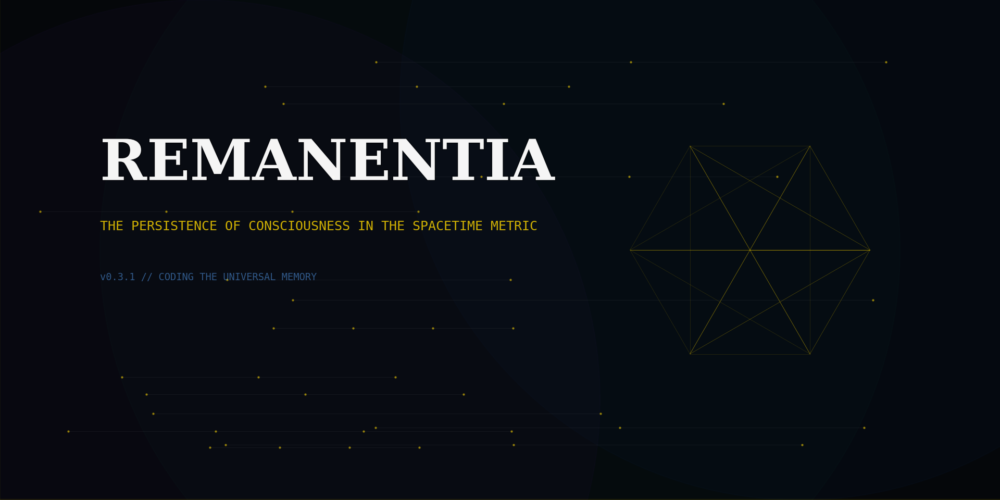

SPDX-License-Identifier: AGPL-3.0-or-later | Commercial license available
© Concepts 1996–2026 Miroslav Šotek. All rights reserved.
© Code 2020–2026 Miroslav Šotek. All rights reserved.
ORCID: 0009-0009-3560-0851
Contact: www.anulum.li | protoscience@anulum.li

# Remanentia

[](https://github.com/anulum/remanentia/actions/workflows/ci.yml)
[](https://github.com/anulum/remanentia/actions/workflows/codeql.yml)
[](https://github.com/anulum/remanentia/actions/workflows/docs.yml)
[](https://securityscorecards.dev/viewer/?uri=github.com/anulum/remanentia)
[](https://www.bestpractices.dev/projects/12340)
[](https://github.com/anulum/remanentia)
[](VALIDATION.md)
[](VALIDATION.md)
[](LICENSE)
[](https://www.python.org/)
[](docs/guides/PERFORMANCE_TUNING.md)
[](https://github.com/astral-sh/ruff)
[](https://github.com/PyCQA/bandit)
[](https://pre-commit.com/)
[](docs/guides/INTEGRATION_GUIDE.md)
[](CITATION.cff)
[](REUSE.toml)



**Persistent AI memory with SNN-orchestrated consolidation, entity graphs, and deep contextual recall.**

BM25+embedding hybrid retrieval with RRF | 11 typed entity relation types | temporal reasoning with date arithmetic | async consolidation | thread-safe MCP server

[remanentia.com](https://www.remanentia.com) | [GitHub](https://github.com/anulum/remanentia) | [ANULUM Ecosystem](https://www.anulum.li)

---

## ANULUM Ecosystem

Remanentia is the **memory layer** of the [ANULUM](https://www.anulum.li) scientific computing ecosystem — a suite of interconnected tools for neuromorphic engineering, AI verification, and stochastic computing research.

| Project | Role | Link |
|---------|------|------|
| **Remanentia** | Persistent AI memory (this repo) | [remanentia.com](https://www.remanentia.com) |
| **SC-NeuroCore** | Stochastic computing SNN framework (122 neuron models, Rust SIMD, FPGA) | [GitHub](https://github.com/anulum/sc-neurocore) |
| **Director-AI** | RAG-grounded AI claim verification (PyPI live) | [GitHub](https://github.com/anulum/director-ai) |
| **SCPN-Fusion-Core** | Spike Codec Prediction Network fusion engine | [GitHub](https://github.com/anulum/SCPN-Fusion-Core) |
| **scpn-phase-orchestrator** | Multi-engine phase orchestration (9 engines, 32 domainpacks) | [GitHub](https://github.com/anulum/scpn-phase-orchestrator) |
| **scpn-quantum-control** | Quantum-classical hybrid control (IBM Quantum, Rust engine) | [GitHub](https://github.com/anulum/scpn-quantum-control) |
| **scpn-control** | Core SCPN control system | [GitHub](https://github.com/anulum/scpn-control) |

Remanentia provides cross-project memory retrieval across all repositories — session logs, reasoning traces, code, and research documents are indexed into a unified search layer that any agent can query via MCP.

---

## What It Does

Remanentia indexes your project's existing files — session logs, code, research documents, reasoning traces — into a unified BM25 index with query intelligence. Ask a question, get the relevant paragraph with an extracted answer.

No vector database. No cloud service. No LLM in the retrieval path.

## Quick Start

```bash
# Install from PyPI
pip install remanentia

# Or install from source
pip install -e .

# Create directory structure
remanentia init

# Add your reasoning traces to reasoning_traces/
# Then consolidate into semantic memories
remanentia consolidate --force

# Search
remanentia search "what did we decide about authentication"
remanentia recall "STDP learning rule" --format context

# System status
remanentia status
```

## Retrieval Pipeline

```
Query
  |
  v
BM25 (real TF + inverted index) .............. first-pass retrieval
  |
  v
Bi-encoder rerank (MiniLM-L6-v2) ............. semantic similarity
  |
  v
Reciprocal Rank Fusion ........................ scale-invariant score fusion
  |
  v
Cross-encoder rerank (MiniLM-L-6-v2) ......... fine-grained re-scoring
  |
  v
Entity graph boost ............................ 11 typed relation types
  |
  v
Temporal graph + date arithmetic .............. TReMu code execution
  |
  v
Answer extraction ............................. query-proximity scoring
  |
  v
Knowledge store (multi-hop graph search) ...... Zettelkasten + prospective queries
```

### Memory Types

| Type | Storage | Example |
|------|---------|---------|
| Episodic | `reasoning_traces/*.md` | Raw session decisions |
| Semantic | `memory/semantic/**/*.md` | Consolidated facts with YAML frontmatter |
| Procedural | `skills/*.json` | Extracted skills and workflows |
| Graph | `memory/graph/*.jsonl` | Entity-entity relations with evidence |

### Components

| File | Role |
|------|------|
| `memory_index.py` | Unified BM25 + embedding index, all scoring and ranking |
| `memory_recall.py` | Deep recall: retrieval + graph + temporal context |
| `mcp_server.py` | Thread-safe MCP server (stdio JSON-RPC), async consolidation |
| `consolidation_engine.py` | Episodic -> semantic compression, typed relation extraction |
| `knowledge_store.py` | Zettelkasten atomic notes, prospective triggers, graph search |
| `temporal_graph.py` | Temporal event graph, relative date resolution, TReMu |
| `entity_extractor.py` | GLiNER2 NER + regex fallback, 11 typed relation types |
| `llm_backend.py` | Pluggable LLM backend: Auto, Local, Anthropic, Null |
| `answer_extractor.py` | Query-proximity answer extraction, LLM fallback |
| `answer_normalizer.py` | Hedging strip, yes/no polarity, semantic similarity |
| `observer.py` | Filesystem watcher -> incremental index updates |
| `reflector.py` | Periodic cluster summarisation + gap detection |
| `arcane_retriever.py` | 4-channel parallel retrieval with RRF fusion |
| `fact_decomposer.py` | Atomic fact decomposition with temporal validity windows |
| `cli.py` | Command-line interface |
| `api.py` | FastAPI REST server |
| `api_server.py` | Lightweight HTTP API for cross-service integration |

### Prerequisites

- Python 3.10+
- numpy (required)
- Optional: sentence-transformers (embedding rerank), torch (GPU), fastapi (REST API), anthropic (cloud LLM)
- Optional: llama.cpp / Ollama for local LLM (any OpenAI-compatible endpoint)

## CLI

```bash
pip install -e ".[all]"     # everything
pip install -e ".[api]"     # REST API only
pip install -e ".[dev]"     # test dependencies
```

## Search Pipeline

```
Query → Classification (8 intent types)
  ↓
BM25 scoring (inverted index, real TF-IDF)
  ↓
Bi-encoder rerank (MiniLM-L6-v2, optional)
  ↓
Cross-encoder rerank (ms-marco-MiniLM, optional)
  ↓
Answer extraction (dates, numbers, versions, names)
  ↓
Results with snippets + extracted answers
```

## Benchmarks

### LongMemEval (committed, reproducible)

500 questions across 6 categories. GPT-4o-mini generation + judge. Results committed in `data/longmemeval_hypotheses.results.jsonl`.

| Category | Score |
|----------|-------|
| single-session-preference | 90.0% (27/30) |
| single-session-assistant | 87.5% (49/56) |
| knowledge-update | 87.2% (68/78) |
| single-session-user | 82.9% (58/70) |
| multi-session | 61.7% (82/133) |
| temporal-reasoning | 45.9% (61/133) |
| **Overall** | **69.0% (345/500)** |

Temporal-reasoning is the weakest category — the primary target for improvement. Hindsight (SOTA with GPT-4 extraction) reports 91.4% on this benchmark.

### LOCOMO (historical, not committed)

1,986 questions from the LOCOMO multi-session QA dataset. Results from experiment runs, not committed to repository. Numbers below are from the last measured run without LLM synthesis:

| Category | Accuracy |
|----------|----------|
| Multi-hop | 82.6% |
| Adversarial | 79.5% |
| Open-domain | 78.7% |
| Single-hop | 55.7% |
| Temporal | 42.7% |
| **Overall** | **74.7%** |

Method: BM25 + token overlap + answer extraction. No embedding rerank, no LLM.

## MCP Integration

For Claude Code, Cursor, or any MCP-compatible tool:

```json
{
  "mcpServers": {
    "remanentia": {
      "command": "python",
      "args": ["path/to/mcp_server.py"]
    }
  }
}
```

Tools:
- `remanentia_recall` — search with full context
- `remanentia_status` — system status
- `remanentia_graph` — entity relationship query

Set `REMANENTIA_BASE` env var to point to a custom memory directory.

## CLI

```bash
remanentia search "query"                    # search (alias for recall)
remanentia recall "query" --format context   # LLM-injectable context
remanentia recall "query" --format json      # machine-readable
remanentia consolidate                       # consolidate new traces
remanentia consolidate --force               # reconsolidate all
remanentia status                            # system stats
remanentia graph --top 15                    # entity relationships
remanentia entities                          # list all entities
remanentia init                              # create directory structure
```

## REST API

```bash
python api.py  # http://localhost:8001/docs

curl -X POST http://localhost:8001/recall \
  -H "Content-Type: application/json" \
  -d '{"query": "STDP learning", "top_k": 3}'

curl http://localhost:8001/status
curl http://localhost:8001/entities
curl http://localhost:8001/graph?top=10
```

## Python API

```python
from memory_index import MemoryIndex

idx = MemoryIndex()
idx.build(use_gpu_embeddings=False)
results = idx.search("what did we decide about auth", top_k=5)

for r in results:
    print(f"{r.name} (score={r.score})")
    if r.answer:
        print(f"  Answer: {r.answer}")
    print(f"  {r.snippet[:100]}")
```

## Rust Acceleration

7 PyO3 crates built with maturin. Python fallback preserved in every module.

| Crate | Speedup | Wired into |
|-------|--------:|------------|
| remanentia_temporal | 14.2× | temporal_graph, date_normalizer |
| remanentia_answer_extractor | 11.4× | answer_extractor |
| remanentia_fact_decomposer | ~7× | fact_decomposer |
| remanentia_answer_normalizer | ~6× | answer_normalizer |
| remanentia_search | ~3-5× | memory_index (BM25, Rayon) |
| arcane_stdp | ~2-3× | snn_backend |
| remanentia_entity_extractor | ~2× | entity_extractor |

Full regex pipeline: **0.60ms** (Rust) vs 9.07ms (Python) on 470K chars = **14.1× on large workloads**.

## Research (Negative Results)

SNN-based retrieval was the original design. After 70+ experiments across 4 learning rules (STDP, BCPNN, Hebbian, E/I balanced), we proved it adds zero discriminative signal. Root cause: 384-dim embeddings hash-encoded into 20K-neuron patterns are too correlated for local learning rules. The current system uses BM25 + optional neural reranking because that's what works.

Full analysis: `paper/remanentia_paper_draft.md`

## Tests

```bash
pip install -e ".[dev]"
pytest tests/ -q
```

1,343 tests, 100% coverage (19 modules, zero lines missing).

## License

AGPL-3.0-or-later | Commercial license available

## Author

Miroslav Šotek ([Anulum](https://www.anulum.li)) | ORCID: [0009-0009-3560-0851](https://orcid.org/0009-0009-3560-0851)

---

<p align="center">
  <a href="https://www.anulum.li">
    
  </a>
  &nbsp;&nbsp;&nbsp;&nbsp;
  <a href="https://www.anulum.li">
    
  </a>
  <br>
  <em>Developed by <a href="https://www.anulum.li">ANULUM</a> / Fortis Studio</em>
</p>
