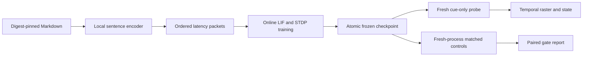

# Temporal SNN memory experiment

This research surface tests one falsifiable claim: online pair-based STDP in a
recurrent E/I LIF network can form trace-specific temporal completion dynamics
that survive removal of a partial text-derived cue. It is isolated from product
retrieval, the historical daemon, and deployment code.

## Boundaries

- Recurrent weights use `W[pre, post]`; current is `spikes @ W`.
- Existing traces decay before the current timestep's LTP/LTD deltas; current
  spikes are added to traces after the deltas.
- Only connected E→E synapses are plastic. Inhibitory weights remain fixed.
- Probe accepts a frozen checkpoint, local encoder checkpoint, and cue file. It
  has no corpus or candidate-document argument and always disables plasticity.
- Checkpoints are published by a same-filesystem staging-directory swap, loaded
  with `allow_pickle=False`, and authenticate both the NPZ arrays and the complete
  epoch×label JSONL training history. Resume refuses model, label, encoder,
  encoder-digest, corpus-digest, seed, input-current, or epoch-direction drift.
- Development and locked corpus manifests pin every source byte digest and the
  local sentence-transformer directory digest.

The accepted equations, hypotheses, controls, seeds, and decision thresholds
are recorded in [ADR-0006](../adr/0006-preregister-temporal-snn-memory-experiment.md).

## Components



`snn_memory.reference` is the readable float64 oracle. `rust_snn_memory` is a
separate float64 PyO3 crate. One installed-PyO3 exact full-episode fixture now
matches spikes, every voltage timestep, recurrent current, traces, refractory
counters, immutable topology, final state, and final weights. That fixture includes
simultaneous excitatory/inhibitory presynaptic spikes and a connected zero-weight
synapse that later potentiates. This is strong cross-language regression evidence
for the declared fixture, not universal parity over every legal configuration;
Rust also does not expose the Python state's diagnostic `step` field.

## Commands

Provision the pinned local encoder at the path and digest declared by the
selected corpus manifest. Missing or changed checkpoints fail closed.

```bash
remanentia-snn-memory train \
  --config experiments/snn_memory/development_config.json \
  --corpus-manifest experiments/snn_memory/development_corpus.json \
  --output .snn_runs/development

remanentia-snn-memory probe \
  --checkpoint .snn_runs/development \
  --cue docs/research/snn_consolidation.md \
  --encoder-checkpoint .snn_models/all-MiniLM-L6-v2 \
  --output .snn_runs/probe.json

remanentia-snn-memory benchmark \
  --checkpoint .snn_runs/development \
  --corpus-manifest experiments/snn_memory/development_corpus.json \
  --seeds 11,29 \
  --output .snn_runs/development-report.json
```

The benchmark CLI command launches each trained, shuffled, random and zero
and encoder-only condition in a fresh `snn_memory.cli condition` subprocess per seed (the model-free
`benchmark(...)` function iterates the same conditions in process). Every child
recalibrates each stored signature from the same cue prefix it then scores, and all
seeds reuse one trained checkpoint, so the current P@1 and trained-minus-shuffled
figures are circular self-matching, not held-out recall; every reported G1 and G2
gate is therefore held fail-closed and those figures are retained only as
non-gating diagnostics. `G2` additionally requires the separate locked corruption,
no-input, complete-seed and mechanism audits; an effect threshold alone cannot mark
it passed. The public result schema enforces this structurally: schema v1 pins every
reported G1/G2 gate to `false`, so no schema-valid v1 report can announce a passed
gate; a held-out harness that can legitimately pass a gate must publish under
`schema_version` 2.

## Verification status

G0 is covered on the Python reference by hand-calculated causal LTP, reverse-order
LTD, simultaneous spike behaviour, refractory and Dale invariants, and
property-generated legal episodes. Rust public contract tests pass, and the one
installed-PyO3 fixture described above matches the Python oracle exactly. The
always-on model-free exact-wheel gate builds one dirty-tree wheel without index
access, installs that exact artefact into a fresh prefix, proves import origins,
creates a checkpoint through the installed API, and drives installed help,
inspection, and verification outside the checkout. The explicit pinned-model gate
separately proves source-process and installed-wheel train/probe surfaces. Run all
non-default model gates with `python tools/verify_snn_memory_model_gates.py`; the
verifier fails if its gate inventory drifts and enforces isolated line-and-branch
coverage for `sentence_encoder.py` and `cli_runners.py`.

That run is a recurrence/activity-control observation only. It is not a G1 recall
result: the benchmark calibrates each stored signature from the same cue prefix it
then scores, so its P@1 is circular self-matching. G1 therefore remains unproven
and open; a valid test needs disjoint held-out cues and fresh-process probes that
read only a frozen checkpoint and one cue. The run is likewise no evidence for G2,
G3, product value, consciousness, biological equivalence, or a 20,000-neuron
system. Locked evaluation results must be reported whether positive or negative;
the evaluation corpus cannot be used for retuning.

The current `recurrence_to_input_ratio` is a whole-array mean and changes when
zero-input completion rows are appended, so it does not yet satisfy G3's “over
time” audit. The held-out schema-v2 harness must persist per-timestep recurrent and
external current, a phase-normalized cue ratio, and autonomous completion
energy/half-life before any G3 claim.
